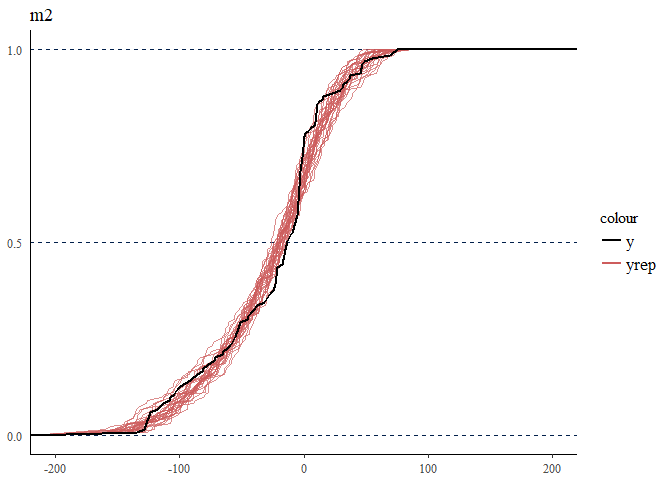
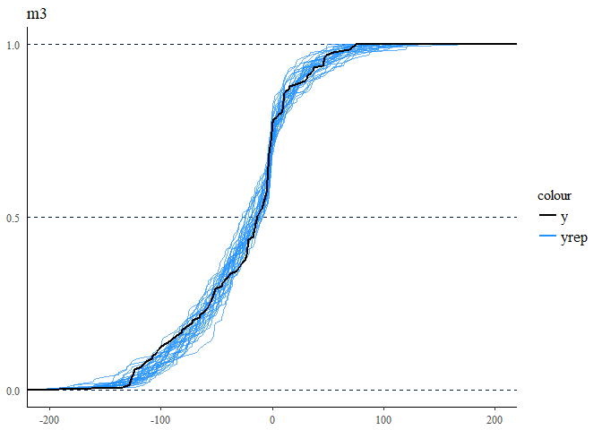

Bayesian GAMs and non-constant variance
================
Bindoff, A.

2018-04-26

The first half of this analysis is lifted from a blog by Gavin Simpson <https://www.fromthebottomoftheheap.net/2018/04/21/fitting-gams-with-brms/>, which shows how to fit a GAM with the `brms` package and Stan in R. The analysis is well documented in the aforementioned blog, with the suggestion that in Part II the non-constant variance will be modelled.

Inspired by how easy it was to fit the model in `brms` I decided not to wait for Part II, and figured it out myself.

    ## Loading required package: nlme

    ## This is mgcv 1.8-23. For overview type 'help("mgcv-package")'.

    ## Loading required package: Rcpp

    ## Loading required package: ggplot2

    ## Loading 'brms' package (version 2.2.0). Useful instructions
    ## can be found by typing help('brms'). A more detailed introduction
    ## to the package is available through vignette('brms_overview').
    ## Run theme_set(theme_default()) to use the default bayesplot theme.

    ## 
    ## Attaching package: 'brms'

    ## The following objects are masked from 'package:mgcv':
    ## 
    ##     s, t2

    ## This is bayesplot version 1.5.0

    ## - Plotting theme set to bayesplot::theme_default()

    ## - Online documentation at mc-stan.org/bayesplot

Load the example data mcycle and plot

``` r
## load the example data mcycle
data(mcycle, package = 'MASS')

## show data
head(mcycle)
```

    ##   times accel
    ## 1   2.4   0.0
    ## 2   2.6  -1.3
    ## 3   3.2  -2.7
    ## 4   3.6   0.0
    ## 5   4.0  -2.7
    ## 6   6.2  -2.7

``` r
ggplot(mcycle, aes(x = times, y = accel)) +
  geom_point() +
  labs(x = "Miliseconds post impact", y = "Acceleration (g)",
       title = "Simulated Motorcycle Accident",
       subtitle = "Measurements of head acceleration")
```


Fit a model, *m*<sub>1</sub> with a GAM using the `mgcv` package.

``` r
m1 <- gam(accel ~ s(times), data = mcycle, method = "REML")
summary(m1)
```

    ## 
    ## Family: gaussian 
    ## Link function: identity 
    ## 
    ## Formula:
    ## accel ~ s(times)
    ## 
    ## Parametric coefficients:
    ##             Estimate Std. Error t value Pr(>|t|)    
    ## (Intercept)  -25.546      1.951  -13.09   <2e-16 ***
    ## ---
    ## Signif. codes:  0 '***' 0.001 '**' 0.01 '*' 0.05 '.' 0.1 ' ' 1
    ## 
    ## Approximate significance of smooth terms:
    ##            edf Ref.df    F p-value    
    ## s(times) 8.625  8.958 53.4  <2e-16 ***
    ## ---
    ## Signif. codes:  0 '***' 0.001 '**' 0.01 '*' 0.05 '.' 0.1 ' ' 1
    ## 
    ## R-sq.(adj) =  0.783   Deviance explained = 79.7%
    ## -REML = 616.14  Scale est. = 506.35    n = 133

Plot the marginal effects

``` r
eS <- predict(m1, newdata = mcycle, type = "response", se = T)
eS <- data.frame(eS, mcycle)

ggplot(eS, aes(x = times, y = fit)) +
  geom_line(size = 1, colour = "blue") +
  geom_ribbon(mapping = aes(ymin = fit - 1.96*se.fit, ymax = fit + 1.96*se.fit), alpha = 0.2) +
  geom_point(data = mcycle, aes(x = times, y = accel)) +
  labs(y = "accel")
```


Bayesian model, *m*<sub>2</sub>, fitted with `brms` as per blog.

``` r
m2 <- brm(bf(accel ~ s(times)),
          data = mcycle, family = gaussian(), cores = 2, seed = 17,
          iter = 4000, warmup = 1000, thin = 10, refresh = 0, 
          control = list(adapt_delta = 0.99))

summary(m2)
```

    ##  Family: gaussian 
    ##   Links: mu = identity; sigma = identity 
    ## Formula: accel ~ s(times) 
    ##    Data: mcycle (Number of observations: 133) 
    ## Samples: 4 chains, each with iter = 4000; warmup = 1000; thin = 10; 
    ##          total post-warmup samples = 1200
    ##     ICs: LOO = NA; WAIC = NA; R2 = NA
    ##  
    ## Smooth Terms: 
    ##               Estimate Est.Error l-95% CI u-95% CI Eff.Sample Rhat
    ## sds(stimes_1)   722.76    185.23   452.01  1189.03       1062 1.00
    ## 
    ## Population-Level Effects: 
    ##           Estimate Est.Error l-95% CI u-95% CI Eff.Sample Rhat
    ## Intercept   -25.53      1.94   -29.32   -21.78       1200 1.00
    ## stimes_1     17.20     38.82   -60.58    98.31       1200 1.00
    ## 
    ## Family Specific Parameters: 
    ##       Estimate Est.Error l-95% CI u-95% CI Eff.Sample Rhat
    ## sigma    22.76      1.49    20.14    26.00       1200 1.00
    ## 
    ## Samples were drawn using sampling(NUTS). For each parameter, Eff.Sample 
    ## is a crude measure of effective sample size, and Rhat is the potential 
    ## scale reduction factor on split chains (at convergence, Rhat = 1).

``` r
#gam.vcomp(m1, rescale = FALSE)

plot(marginal_effects(m2), points = TRUE)
```


It is clear that variance is not constant, but the model has made this assumption. Now fit a distributional regression model, *m*<sub>3</sub> which allows for non-constant variance.

``` r
## Distributional regression model

m3 <- brm(bf(accel ~ s(times), sigma ~ s(times)),
  data = mcycle, family = gaussian(),
  cores = 2, seed = 17,
  iter = 4000, warmup = 1000, thin = 10, refresh = 0, 
  control = list(adapt_delta = 0.99, max_treedepth = 15)
)
summary(m3)
```

    ##  Family: gaussian 
    ##   Links: mu = identity; sigma = log 
    ## Formula: accel ~ s(times) 
    ##          sigma ~ s(times)
    ##    Data: mcycle (Number of observations: 133) 
    ## Samples: 4 chains, each with iter = 4000; warmup = 1000; thin = 10; 
    ##          total post-warmup samples = 1200
    ##     ICs: LOO = NA; WAIC = NA; R2 = NA
    ##  
    ## Smooth Terms: 
    ##                     Estimate Est.Error l-95% CI u-95% CI Eff.Sample Rhat
    ## sds(stimes_1)         646.72    170.14   400.52  1086.75       1200 1.00
    ## sds(sigma_stimes_1)    12.04      6.28     3.60    28.23        991 1.00
    ## 
    ## Population-Level Effects: 
    ##                 Estimate Est.Error l-95% CI u-95% CI Eff.Sample Rhat
    ## Intercept         -25.00      2.19   -29.34   -20.49       1200 1.00
    ## sigma_Intercept     2.76      0.07     2.63     2.91       1075 1.00
    ## stimes_1           29.45     18.89    -3.04    71.10        981 1.00
    ## sigma_stimes_1     -1.36      1.72    -5.09     1.57       1060 1.00
    ## 
    ## Samples were drawn using sampling(NUTS). For each parameter, Eff.Sample 
    ## is a crude measure of effective sample size, and Rhat is the potential 
    ## scale reduction factor on split chains (at convergence, Rhat = 1).

``` r
plot(marginal_effects(m3), points = TRUE)
```


This looks much better. Now compare models using posterior predictive checks (generate data from the models and compare to observed data). Red is *m*<sub>2</sub> and blue is *m*<sub>3</sub>.

``` r
par(mfrow = c(2, 2))
pp_check(m2, nsamples = 30) + ggplot2::scale_color_manual(values = c("black", "indianred")) +
  ggplot2::xlim(-200, 200)
```


``` r
pp_check(m3, nsamples = 30) + ggplot2::scale_color_manual(values = c("black", "dodgerblue")) +
  ggplot2::xlim(-200, 200)
```


``` r
pp_check(m2, nsamples = 30, type = "ecdf_overlay") + ggplot2::scale_color_manual(values = c("black", "indianred")) +
  ggplot2::xlim(-200, 200)
```



``` r
pp_check(m3, nsamples = 30, type = "ecdf_overlay") + ggplot2::scale_color_manual(values = c("black", "dodgerblue"))+   ggplot2::xlim(-200, 200)
```



Compare models with Leave One Out cross-validation (smaller is better)

``` r
LOO(m2, m3)
```

    ##           LOOIC    SE
    ## m2      1217.20 20.42
    ## m3      1131.41 25.56
    ## m2 - m3   85.79 19.46
